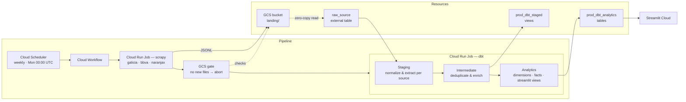

# Architecture

This document is the technical deep-dive companion to [README.md](README.md). README covers setup, design decisions, and the quick-start guide. This document covers internals: how each component actually works, what GCP resources exist, how orchestration and security are structured, and what to look at when something breaks.

Sections are ordered so each one builds on the previous.

---

## 1. Overview

The system is a weekly ELT pipeline that collects discount promotions from Argentine bank websites, transforms them into a consistent schema, and serves the result in a public Streamlit dashboard. It runs entirely on GCP with no persistent servers — everything is event-driven or scheduled.

### Architecture diagram



### Component map

| Component | Directory | Runtime |
|---|---|---|
| Scrapy spiders | [discount_tracker_scrapy/](discount_tracker_scrapy/) | Cloud Run Job (Docker) |
| dbt models | [discount_tracker_dbt/](discount_tracker_dbt/) | Cloud Run Job (Docker) |
| Streamlit dashboard | [discount_tracker_streamlit/](discount_tracker_streamlit/) | Streamlit Cloud |
| GCP infrastructure | [terraform/](terraform/) | Terraform (local state) |
| Workflow definition | [terraform/workflow.yaml](terraform/workflow.yaml) | Cloud Workflows |

---

## 2. Infrastructure

All GCP resources are declared in [terraform/](terraform/) and applied with the Google provider (`~> 5.0`). State is stored locally — there is no remote backend. The target region is `us-east1`, chosen for GCP Always Free tier eligibility.

### Applying

```bash
terraform -chdir=terraform apply \
  -var gcp_project_id=<your-project-id>
```

`gcp_region` defaults to `us-east1` and can be overridden with `-var gcp_region=<region>`.

### Resources

| File | Resource | GCP name | Purpose |
|---|---|---|---|
| `storage.tf` | `google_storage_bucket` | `{project}-discount-lake` | Raw JSONL landing zone |
| `storage.tf` | `google_bigquery_dataset` | `raw_source` | Bronze layer — external table over GCS |
| `storage.tf` | `google_bigquery_dataset` | `prod_dbt_staged` | Silver layer — staging & intermediate views (prod) |
| `storage.tf` | `google_bigquery_dataset` | `prod_dbt_analytics` | Gold layer — analytics tables (prod) |
| `storage.tf` | `google_bigquery_dataset` | `dev_dbt_staged` | Silver layer (dev) |
| `storage.tf` | `google_bigquery_dataset` | `dev_dbt_analytics` | Gold layer (dev) |
| `storage.tf` | `google_bigquery_table` | `raw_discounts` | External table pointing to GCS landing zone |
| `jobs.tf` | `google_service_account` | `discount-tracker-scraper` | Identity for the scrapy Cloud Run job |
| `jobs.tf` | `google_cloud_run_v2_job` | `discount-tracker-scrapy-job` | Runs scrapy spiders on demand |
| `jobs.tf` | `google_service_account` | `discount-tracker-dbt-runner` | Identity for the dbt Cloud Run job |
| `jobs.tf` | `google_cloud_run_v2_job` | `discount-tracker-dbt-job` | Runs dbt transformations on demand |
| `workflow.tf` | `google_service_account` | `discount-tracker-workflows-sa` | Identity for the workflow and scheduler |
| `workflow.tf` | `google_workflows_workflow` | `discount-tracker-prod-workflow` | Orchestrates scrapy → GCS gate → dbt |
| `workflow.tf` | `google_cloud_scheduler_job` | `discount-tracker-weekly` | Triggers workflow every Monday 00:00 UTC |
| `workflow.tf` | `google_project_service` | `workflows.googleapis.com` | Enables Workflows API |
| `workflow.tf` | `google_project_service` | `cloudscheduler.googleapis.com` | Enables Cloud Scheduler API |
| `monitoring.tf` | `google_logging_metric` ×5 | `scrapy/*` | Log-based metrics from scrapy stats (see §8) |

### BigQuery dataset layout

```text
raw_source          ← bronze: external table, reads directly from GCS
prod_dbt_staged     ← silver: staging and intermediate dbt views (prod)
prod_dbt_analytics  ← gold:   analytics tables served to Streamlit (prod)
dev_dbt_staged      ← silver: development target
dev_dbt_analytics   ← gold:   development target
```

The dev datasets mirror the prod structure and are used when running dbt with `--target local-dev`. The workflow always runs against prod targets (`cloud-run-prod`).

### GCS bucket

The bucket (`{project}-discount-lake`) has a 30-day lifecycle delete rule on all objects and `uniform_bucket_level_access` enabled. Raw files land under `landing/` and are never modified after write — the external table reads them in place.

---

## 3. Pipeline — Extraction

The scraper lives in [discount_tracker_scrapy/](discount_tracker_scrapy/). Three spiders collect promotions from Argentine bank APIs and write raw JSONL files to GCS. All spiders yield plain dicts — no Scrapy `Item` classes — because all field normalization lives in dbt.

### Common patterns

Every spider accepts an optional `page_limit` constructor argument to cap pagination during testing. The workflow passes `CLOSESPIDER_ITEMCOUNT` instead (a Scrapy built-in setting), which stops a spider after N items regardless of pagination state.

### Spiders

#### `galicia` — [spiders/galicia.py](discount_tracker_scrapy/spiders/galicia.py)

Source: `loyalty.bff.bancogalicia.com.ar`

1. Starts at page 1 of the catalog API (`/promociones/catalogo?page={n}&pageSize=15`)
2. For each item with an `id`, dispatches a detail request to `/promociones/idPromocion/{id}`
3. Advances to the next page until the catalog returns an empty list
4. Yields `{ source_id, **detail_response_data }`

#### `bbva` — [spiders/bbva.py](discount_tracker_scrapy/spiders/bbva.py)

Source: `go.bbva.com.ar`

1. Fetches the full category list from `/API/v3/rubros/filtro`
2. For each category, paginates the catalog (`/API/v3/communications?pager={n}&rubros={cat_id}`) starting at page 0
3. Reads the page count from the API's `message` field via regex (`paginas:\s*(\d+)`) on the first page of each category
4. For each catalog item, dispatches a detail request to `/API/v3/communication/{id}`
5. Yields `{ source_id, discount_start_date, discount_end_date, subcabecera, category_name, **detail_response_data }`
6. Tracks items scraped per category in Scrapy stats (`custom/items_scraped/{category_name}`)

#### `naranjax` — [spiders/naranjax.py](discount_tracker_scrapy/spiders/naranjax.py)

Source: `bkn-promotions.naranjax.com`

The BFF validates that requests look like same-site browser fetches, so all requests are POSTs with a full set of Chrome headers (`Origin: https://www.naranjax.com`, `Sec-Fetch-*`, `sec-ch-ua`). `ROBOTSTXT_OBEY` is disabled via `custom_settings`.

All requests include a Buenos Aires geolocation payload (`-34.61315, -58.37723`).

1. Fetches page 1 of the catalog; reads `info.total` and `info.itemsByPage` to compute total pages, then fans out all remaining pages concurrently
2. Two item types per catalog response:
   - **Single-plan** (has `urlDetail`): dispatches a detail POST to `/binder/{commerce}/detail/{plan}`; the detail response has `commerces` (store list) popped before yielding to avoid very large payloads; yields `{ **catalog_item, "detail": detail_response }`
   - **Multi-plan** (no `urlDetail`): yielded directly from catalog data; plans are unnested in the staging layer

### Output

Items are processed by a single active pipeline before being written to storage:

**`RawPayloadWrapperPipeline`** — wraps every item as `{"raw_payload": dict(item)}`. This produces a single-column JSONL schema that matches the `raw_discounts` BigQuery external table, which has one column (`raw_payload JSON`) plus the two hive partition columns.

Files are written via Scrapy's `FEEDS` config. The destination is controlled by the `STORAGE_BACKEND` environment variable:

| `STORAGE_BACKEND` | Output path |
|---|---|
| `gcs` | `gs://{GCS_BUCKET}/landing/spider=%(name)s/scraped_at_dt={today}/%(time)s.jsonl` |
| `local` (default) | `data/landing/%(name)s/%(time)s.jsonl` |

Each run produces one file per spider. Files are never overwritten — the `%(time)s` timestamp in the path guarantees uniqueness.

### Docker image

The scraper runs from the `scrapy` target of the [Dockerfile](Dockerfile), built in two stages: a `uv`-based builder installs only the `scrapy` dependency group into a virtualenv, then a slim `python:3.12-slim-bookworm` runtime copies just the virtualenv and the spider code. The dbt toolchain is never present in the scrapy image.

### Throttling

AutoThrottle is enabled and dynamically adjusts the delay between requests based on server latency:

| Setting | Value | Meaning |
|---|---|---|
| `DOWNLOAD_DELAY` | `0.5s` | Minimum floor between requests to the same domain |
| `AUTOTHROTTLE_START_DELAY` | `5s` | Initial delay on the first request |
| `AUTOTHROTTLE_MAX_DELAY` | `60s` | Upper bound on delay |
| `AUTOTHROTTLE_TARGET_CONCURRENCY` | `1.0` | Target one request in flight at a time |

The effective delay is `server_latency / TARGET_CONCURRENCY`, floored at `DOWNLOAD_DELAY`. With `TARGET_CONCURRENCY = 1.0`, the spider behaves close to sequentially against each domain.

---

## 4. Pipeline — Loading

There is no separate loading step. Raw files written to GCS by the scraper are immediately queryable in BigQuery through an external table — no data movement, no ETL job.

### GCS landing zone structure

Files land under the `landing/` prefix using hive-compatible path segments:

```
landing/
  spider=galicia/
    scraped_at_dt=2025-06-02/
      20250602T210000.jsonl
  spider=bbva/
    scraped_at_dt=2025-06-02/
      20250602T211500.jsonl
  spider=naranjax/
    scraped_at_dt=2025-06-02/
      20250602T213000.jsonl
```

Each file is a newline-delimited JSON file where every line is `{"raw_payload": {...}}`.

### BigQuery external table

The `raw_discounts` table in the `raw_source` dataset is an external table that reads from `gs://{bucket}/landing/*` at query time. It is defined in [terraform/storage.tf](terraform/storage.tf) with hive partitioning in `AUTO` mode, which means BigQuery automatically infers `spider` and `scraped_at_dt` as partition columns from the path structure.

Effective schema:

| Column | Type | Source |
|---|---|---|
| `spider` | `STRING` | Inferred from `spider=<value>` path segment |
| `scraped_at_dt` | `DATE` | Inferred from `scraped_at_dt=<value>` path segment |
| `raw_payload` | `JSON` | Contents of each JSONL line |

`require_partition_filter = true` is set on the table, meaning every query must include a filter on `spider` or `scraped_at_dt`. This prevents accidental full scans of the entire landing zone as data accumulates.

### dbt source reference

The external table is registered in dbt as source `staging.raw_discounts` in [models/staging/sources.yml](discount_tracker_dbt/models/staging/sources.yml). All staging models read from `{{ source('staging', 'raw_discounts') }}` with a `WHERE spider = '<name>'` filter, which satisfies the partition requirement and scopes each model to its own spider's data.

---

## 5. Pipeline — Transformation

The dbt project lives in [discount_tracker_dbt/](discount_tracker_dbt/). It implements a medallion structure across four model layers, all routed to BigQuery datasets via [dbt_project.yml](discount_tracker_dbt/dbt_project.yml).

### Layer overview

| Layer | Models | Dataset | Materialization |
|---|---|---|---|
| Staging | `stg_galicia`, `stg_bbva`, `stg_naranjax` | `{env}_dbt_staged` | View |
| Intermediate | `int_joined_deduped_and_normalized_discounts`<br>`int_business_dedup_audit`<br>`int_business_deduped_discounts` | `{env}_dbt_staged` | View |
| Analytics — core | `dim_issuers`, `dim_merchants`, `fct_discounts` | `{env}_dbt_analytics` | Table / Incremental |
| Analytics — streamlit | `streamlit_data`, `issuer_metadata` | `{env}_dbt_analytics` | Table |

`{env}` is `prod` in Cloud Run and `dev` locally (`--target local-dev`).

---

### Staging layer

Each staging model reads from `raw_discounts` filtered to its own spider and extracts a uniform 18-column schema from the `raw_payload` JSON column using `JSON_VALUE`. All three models produce the same column set so they can be unioned cleanly in the intermediate layer.

**Source-specific differences:**

**Dates** — each source uses a different format:

| Spider | Format | Example |
|---|---|---|
| `bbva` | `%Y-%m-%d` | `2025-01-31` |
| `galicia` | `%d/%m/%Y` | `31/01/2025` |
| `naranjax` | `%d/%m/%Y` | `31/01/2025` |

**Discount rate** — normalized to a 0–1 float using different source fields:

| Spider | Approach |
|---|---|
| `galicia` | `porcentajeAhorro / 100` (e.g. `20` → `0.20`) |
| `bbva` | Regex extraction from `cabecera`/`subcabecera` text |
| `naranjax` | `detail.benefit.discountPercentage`; falls back to regex on `title` |

**Valid days list** — normalized to a 0-based integer array (0 = Monday, 6 = Sunday) from three different encodings:

| Spider | Encoding | Example |
|---|---|---|
| `galicia` | Semicolon-separated Spanish abbreviations | `"Lu;Mi;Vi"` → `[0, 2, 4]` |
| `bbva` | 7-character bitmask string | `"1010100"` → `[0, 2, 4]` |
| `naranjax` | 1-based weekday integers | `[1, 3, 5]` → `[0, 2, 4]` |

---

### Intermediate layer

**`int_joined_deduped_and_normalized_discounts`**

Unions all three staging models, generates a `discount_id` surrogate key from `(source_id, issuer_name)` using `dbt_utils.generate_surrogate_key`, applies null coalescing on numeric fields, and deduplicates by `discount_id` keeping the most recent scrape:

```sql
QUALIFY ROW_NUMBER() OVER (PARTITION BY discount_id ORDER BY last_updated_at_date DESC) = 1
```

**`int_business_dedup_audit`**

Some issuers publish the same promotion with different source IDs across scrape runs. This model generates a `discount_content_hash` surrogate key from 12 business-content fields (issuer, merchant, category, dates, rate, amounts, installments, valid days, online/instore flags) and assigns a `ROW_NUMBER()` within each hash group, ordered by recency. All rows are kept for auditing.

**`int_business_deduped_discounts`**

Filters the audit model to `rn = 1`, yielding one canonical row per unique business-level discount. This is the input to the analytics layer.

---

### Analytics — core layer

**`dim_issuers`** — distinct `issuer_name` values with a surrogate `id`.

**`dim_merchants`** — distinct `(merchant_name, merchant_category_name)` pairs joined to the `merchant_category_mapping` seed on lowercased `merchant_category_name`. The seed maps raw category strings from the source APIs (e.g. `Automotores`, `Bares`) to normalized Spanish labels (e.g. `Vehículos`, `Gastronomía`). Rows without a match fall back to `'Sin categorizar'`.

**`fct_discounts`** — the main fact table, materialized as incremental with `unique_key='id'` and merge strategy. Joins `int_business_deduped_discounts` with both dimension tables and drops the `discount_` prefix from all columns.

Incremental filter:

```sql
WHERE last_updated_at_date > (SELECT MAX(last_updated_at_date) FROM {{ this }})
```

A `cutoff_date` dbt variable can be passed at run time to simulate historical loads for testing incremental logic.

---

### Analytics — streamlit layer

**`streamlit_data`** — joins `fct_discounts`, `dim_merchants`, and `dim_issuers`, reinstates the `discount_` prefix on all columns, uses `category_name_normalized` from the merchant dim, and adds a computed `discount_is_active` boolean (`start_date <= CURRENT_DATE AND end_date > CURRENT_DATE`). This is the primary table the Streamlit app reads.

**`issuer_metadata`** — aggregates `fct_discounts` by issuer to produce `last_scraped_at` (max `last_updated_at_date`) and `discount_count`. Used by the issuer status page.

---

### Test strategy

Tests are layered to match each layer's responsibility.

**Intermediate** — validates that mandatory fields are populated, business logic holds, and the deduplication strategy produces no duplicates:
- `discount_id` is `not_null` and `unique` (no duplicate scrapes survive)
- `discount_content_hash` is `not_null` and `unique` on `int_business_deduped_discounts` (no business-level duplicates)
- `discount_rate` between 0–1; `discount_no_interest_installment_qty` ≥ 0
- `discount_end_date >= discount_start_date` (`dbt_expectations.expect_column_pair_values_A_to_be_greater_than_B`)
- All date and boolean fields `not_null`
- `valid_days_list` integers are all in 0–6 (custom singular test)

**Analytics — core** — validates that dimensional modelling is applied correctly:
- `dim_issuers.id` and `dim_merchants.id` are `not_null` and `unique`
- `fct_discounts.id` is `not_null` and `unique`
- `fct_discounts.issuer_id` and `fct_discounts.merchant_id` are `not_null` and pass `relationships` tests against their respective dimension tables — every fact row resolves to a known dimension member
- `dim_merchants.category_name_normalized` is `not_null`; a custom singular test asserts no row carries the fallback value `'Sin categorizar'`, ensuring the category seed covers all raw category strings

**Analytics — streamlit** — reconciliation tests ensuring the streamlit layer stays consistent with the core entities it is built from:
- `issuer_metadata_recon_check` cross-joins the total row count in `fct_discounts` against the sum of `discount_count` across all rows in `issuer_metadata` and fails if they differ

---

## 6. Pipeline — Presentation

The dashboard lives in [discount_tracker_streamlit/app.py](discount_tracker_streamlit/app.py) and is deployed to [catalogo-de-descuentos.streamlit.app](https://catalogo-de-descuentos.streamlit.app). It is a read-only consumer of the curated BigQuery models — no writes, no direct access to raw data.

### Authentication and data loading

The app authenticates to BigQuery using a service account stored in `st.secrets["gcp_service_account"]`. The target BigQuery database prefix (`prod` or `dev`) is read from `st.secrets["bigquery"]["database"]`, which controls which dataset the queries hit without any code change.

SQL queries live as plain files in [utils/queries/](discount_tracker_streamlit/utils/queries/). At load time `{project_id}` and `{bigquery_db}` placeholders are substituted. Two cached functions fetch all data on first render and hold it for 10 minutes:

| Function | Query | Used by |
|---|---|---|
| `load_discount_data()` | `streamlit_data.sql` | Discount explorer page |
| `load_issuer_metadata()` | `issuer_metadata.sql` | Issuer status page |

### Pages

**"Explorar descuentos"** (`page_guided_search`) — the primary discovery flow. Filtering is intentionally two-step to reduce noise:

1. User specifies a merchant name (text input) and/or a category (selectbox)
2. The app pre-filters the dataset and surfaces only the issuers that have matching discounts — user selects which ones to include
3. A second filter row appears with day-of-week filter, merchant refinement, sort order (biggest discount or most installments), and a toggle to include expired discounts

Results render as a 3-column card grid, 20 at a time, with a "load more" button that increments the visible count in session state and reruns.

Each card shows: merchant category and issuer icon in a header bar, merchant name, discount percentage and interest-free installment count as large badges, a detail row (issuer, format, date range, minimum purchase, cap), day-of-week circles (filled = valid, empty = not valid), and a popover for terms and conditions. Active and expired discounts render with different color schemes (green vs gray).

**"Entidades disponibles"** (`page_issuer_status`) — issuer summary view. Shows three top-level metrics (active issuers, total discounts, last update timestamp), then one bordered card per issuer with its icon, name, last scrape date, and discount count.

### Icon resolution

Issuer names are normalized (lowercased, accents stripped, non-alphanumeric removed) and looked up in [utils/issuer_icon_mapping.csv](discount_tracker_streamlit/utils/issuer_icon_mapping.csv). Matched icon files from [utils/icons/](discount_tracker_streamlit/utils/icons/) are base64-encoded and rendered as inline `` tags, avoiding any external image hosting dependency.

---

## 7. Orchestration

The pipeline is orchestrated by a Cloud Workflow defined in [terraform/workflow.yaml](terraform/workflow.yaml). The workflow is triggered weekly by Cloud Scheduler and can also be invoked manually through the GCP console or via the test script in [scripts/test_workflow.py](scripts/test_workflow.py).

### Parameters

All parameters are optional. Defaults match the production deployment.

| Parameter | Default | Description |
|---|---|---|
| `spiders` | `["galicia","bbva","naranjax"]` | Spider names to run |
| `close_spider_itemcount` | `0` | Item cap per spider; `0` = no cap. Used for test runs |
| `dbt_cmd` | `"build"` | dbt command string; may include flags e.g. `"build --select stg_galicia+"` |
| `dbt_target` | `"local-dev"` | dbt profile target |
| `skip_scrapy` | `false` | Skip spider runs and the GCS gate; jump straight to dbt |
| `skip_dbt` | `false` | Stop after scraping; skip dbt |
| `project_id` / `region` / `bucket` / `scrapy_job` / `dbt_job` | prod values | Infrastructure overrides for non-prod testing |

### Execution flow

```
init
 └─ check_skip_scrapy ──(skip_scrapy=true)──▶ check_skip_dbt
         │
         ▼
 run_spiders_in_parallel      ← parallel for loop, one branch per spider
         │
         ▼
     check_gcs                ← GCS gate: abort if no new files
         │
         ▼
 check_skip_dbt ──(skip_dbt=true)──▶ return_summary
         │
         ▼
      run_dbt
         │
         ▼
   return_summary
```

### Spider execution (`run_spider`)

Each spider branch in the parallel loop calls the `run_spider` sub-routine, which:

1. Builds job args: `["crawl", spider]`, extended to `["crawl", spider, "-s", "CLOSESPIDER_ITEMCOUNT=N"]` when `close_spider_itemcount > 0`
2. Calls `run_and_wait_job` to trigger the Cloud Run job and block until it completes
3. Returns the Cloud Run execution name for audit purposes

Item counts are not tracked in the workflow; observability is handled entirely by the log-based metrics in Cloud Monitoring (see [Monitoring](#8-monitoring)).

### Job triggering (`run_and_wait_job`)

Cloud Run jobs have static default args baked into their Terraform definition. The workflow overrides them at execution time using `containerOverrides`:

```yaml
body:
  overrides:
    containerOverrides:
      - args: ${job_args}
```

This lets a single Cloud Run job definition serve all spiders and any dbt command variant without requiring separate job resources per configuration.

The trigger returns a Long-Running Operation (LRO). The sub-routine polls the LRO URL every 10 seconds until `done == true`. On completion, if the LRO body contains an `error` key the workflow raises the error message and fails; otherwise it extracts the execution name from the last path segment of `response.name` and returns it.

### GCS gate (`check_new_gcs_files`)

After all spiders complete, the workflow calls `check_new_gcs_files` before running dbt. The sub-routine:

1. Paginates all objects under `landing/` using the GCS JSON API, following `nextPageToken` until all pages are exhausted
2. For each object, compares `timeCreated` against `workflow_start_time` (captured at `init`)
3. If the total count of new objects is zero, raises an error and aborts — dbt never runs on stale data

This gate handles partial failures gracefully: if some spiders succeeded and others failed, the healthy spiders' output still satisfies the gate and dbt runs on whatever was scraped.

### Workflow return value

The workflow returns a summary object for auditing executions in the Cloud Workflows console:

```json
{
  "spider_executions": {
    "galicia":  "discount-tracker-scrapy-job-execution-xxxx",
    "bbva":     "discount-tracker-scrapy-job-execution-yyyy",
    "naranjax": "discount-tracker-scrapy-job-execution-zzzz"
  },
  "new_gcs_files": 3,
  "dbt_execution": "discount-tracker-dbt-job-execution-aaaa"
}
```

Each execution name can be used to look up logs, job status, and metrics for a specific run in the GCP console.

### Cloud Scheduler

Cloud Scheduler triggers the workflow via an authenticated HTTP POST to the Workflows executions API every Monday at 00:00 UTC (Monday 9 PM GMT-3). The request body encodes the production argument set:

```json
{ "spiders": ["galicia","bbva","naranjax"], "dbt_cmd": "build", "dbt_target": "cloud-run-prod" }
```

The scheduler uses the workflow service account's OAuth2 token for auth. The `attempt_deadline` is set to 1800 seconds — if the workflow doesn't acknowledge within that window, Scheduler retries.

---

## 8. Monitoring

### WORKFLOW_STATS log pattern

When a spider finishes, `DiscountTrackerScrapySpiderMiddleware.spider_closed` emits all Scrapy stats as a single structured JSON line to stderr:

```
WORKFLOW_STATS {"item_scraped_count": 142, "elapsed_time_seconds": 87.3, "response_received_count": 148, "spider": "galicia", "finish_reason": "finished", ...}
```

The middleware collects the full stats dict from `spider.crawler.stats.get_stats()`, serializes `datetime` values to ISO 8601 strings, filters out non-serializable types, then appends `spider` and `finish_reason` before logging. Every scalar stat Scrapy tracks is present in the payload and is available directly in Cloud Logging. The workflow does not read from this log line — item counts and timing are consumed exclusively by the log-based metrics described below.

This single log line serves two purposes: the workflow parses it to report per-spider item counts in the execution summary, and Cloud Logging's log-based metrics extract specific fields from it for time-series monitoring.

### Log-based metrics

Five metrics are declared in [terraform/monitoring.tf](terraform/monitoring.tf). All share the same log filter, scoped tightly to avoid noise from other jobs:

```
resource.type="cloud_run_job"
resource.labels.job_name="discount-tracker-scrapy-job"
logName="projects/{project}/logs/run.googleapis.com%2Fstderr"
textPayload=~"WORKFLOW_STATS"
```

All five are `DELTA DISTRIBUTION` metrics — each run contributes one data point — with exponential bucket options (64 buckets, growth factor 2, scale 1) and a `spider` label extracted via `REGEXP_EXTRACT(textPayload, "spider[^a-z]+([a-z]+)")`.

| Metric | Value extractor | What it tells you |
|---|---|---|
| `scrapy/items_scraped` | `item_scraped_count[^0-9]+([0-9]+)` | Volume scraped per spider per run |
| `scrapy/elapsed_seconds` | `elapsed_time_seconds[^0-9]+([0-9.]+)` | Run duration — detect performance regressions |
| `scrapy/responses_per_minute` | `responses_per_minute[^0-9]+([0-9.]+)` | Crawl throughput |
| `scrapy/items_per_minute` | `items_per_minute[^0-9]+([0-9.]+)` | Pipeline efficiency (items extracted per unit time) |
| `scrapy/403_responses` | `response_status_count/403[^0-9]+([0-9]+)` | Blocking / anti-scraping signal |

The `spider` label on each data point enables per-spider breakdown in Cloud Monitoring without needing separate metrics per spider.

### Viewing metrics

In the GCP console: **Cloud Monitoring → Metrics Explorer → Metric type**: `logging/user/scrapy/<metric_name>`. Group by `spider` to see per-spider series. Since the metrics are `DELTA`, each weekly run appears as a single bar per spider rather than a cumulative line.

For ad-hoc inspection of full spider stats without waiting for metric ingestion, query Cloud Logging directly with:

```
resource.type="cloud_run_job"
resource.labels.job_name="discount-tracker-scrapy-job"
textPayload=~"WORKFLOW_STATS"
```

---

## 9. Security & IAM

All service accounts and role bindings are declared in [terraform/jobs.tf](terraform/jobs.tf) and [terraform/workflow.tf](terraform/workflow.tf). Each runtime has its own identity with only the permissions it needs to do its job.

### Service accounts

| SA | Account ID | Used by |
|---|---|---|
| Scraper SA | `discount-tracker-scraper` | Cloud Run scrapy job |
| dbt SA | `discount-tracker-dbt-runner` | Cloud Run dbt job |
| Workflow SA | `discount-tracker-workflows-sa` | Cloud Workflow + Cloud Scheduler |
| Streamlit SA | `discount-tracker-streamlit` | Streamlit Cloud dashboard |

Streamlit uses a fourth service account declared in `jobs.tf`. Its key is exported and stored in Streamlit Cloud's secrets manager (`st.secrets["gcp_service_account"]`).

### Role assignments

**Scraper SA**

| Role | Scope | Why |
|---|---|---|
| `roles/storage.objectCreator` | Project | Write JSONL files to GCS |
| `roles/storage.legacyBucketReader` | Bucket | List the bucket (required separately under uniform bucket-level access) |
| `roles/iam.serviceAccountUser` | SA | Allows the developer account to impersonate the SA for local testing |

The scraper can write to GCS but cannot read objects back. It has no BigQuery access.

**dbt SA**

| Role | Scope | Why |
|---|---|---|
| `roles/bigquery.jobUser` | Project | Submit and run BigQuery jobs (queries, DML) |
| `roles/bigquery.dataEditor` | Project | Read and write data across all datasets |
| `roles/storage.objectViewer` | Bucket | Read GCS objects for the `raw_discounts` external table |
| `roles/iam.serviceAccountUser` | SA | Developer impersonation for local runs |

dbt can read from GCS and read/write BigQuery, but cannot write to GCS or invoke other GCP services.

**Workflow SA**

| Role | Scope | Why |
|---|---|---|
| `roles/run.developer` | Project | Trigger Cloud Run jobs and poll their execution status |
| `roles/logging.viewer` | Project | Read Cloud Logging entries to extract spider stats |
| `roles/logging.logWriter` | Project | Write workflow-level logs via `sys.log` |
| `roles/storage.objectViewer` | Project | List and read GCS objects for the GCS gate check |
| `roles/workflows.invoker` | Project | Allow Cloud Scheduler to invoke the workflow via OAuth2 |

The workflow SA cannot read or write BigQuery directly, cannot modify GCS objects, and has no access to raw scraped data. Its logging access is read-only except for its own log writes.

### Least-privilege boundaries

**Streamlit SA**

| Role | Scope | Why |
|---|---|---|
| `roles/bigquery.jobUser` | Project | Submit queries against BigQuery |
| `roles/bigquery.dataViewer` | `prod_dbt_analytics` dataset | Read `streamlit_data` and `issuer_metadata` (prod) |
| `roles/bigquery.dataViewer` | `dev_dbt_analytics` dataset | Read analytics tables (dev) |
| `roles/iam.serviceAccountUser` | SA | Developer impersonation |

Dataset-level `dataViewer` is used instead of a project-level role — the Streamlit SA cannot see any other dataset in the project.

### Least-privilege boundaries

```
Scraper     → GCS (write only)
dbt         → GCS (read only) + BigQuery (read/write)
Workflow    → Cloud Run (trigger) + Cloud Logging (read) + GCS (read for gate)
Streamlit   → BigQuery analytics datasets (read only)
```

No single service account spans the full pipeline. The workflow can start jobs but cannot see their data. The scraper can produce data but cannot query it. dbt can transform data but cannot trigger other services.

