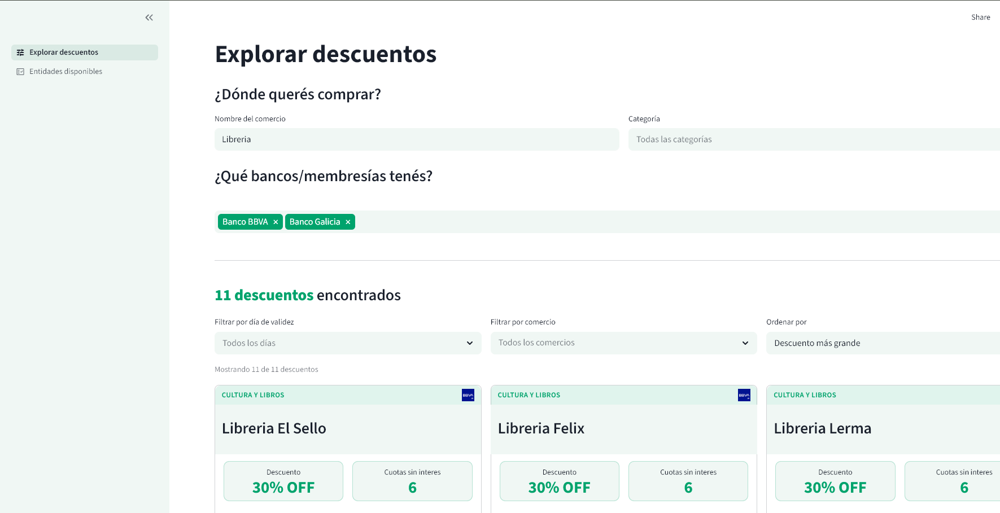

# 💸 Discount Tracker

Discount Tracker is a platform that helps track discounts for different banks and other issuing entities in Argentina, implementing a full ELT cloud data pipeline. It scrapes live discount data from various sources, standardizes and validates it using dbt, and serves the curated result in a [Streamlit Dashboard](https://catalogo-de-descuentos.streamlit.app/).

> NOTE: this was my submission for the 2026 edition of the [Data Engineering Zoomcamp](https://datatalks.club/blog/data-engineering-zoomcamp.html) (DataTalksClub) capstone project. As such, it's not intended to be an extensive catalog of discounts available across all entities in Argentina, but rather a quick prototype to showcase tools and concepts learned.

> NOTE: The UI is in Spanish because the target audience is in Argentina. Browser translation usually works well if you want to inspect it in another language.



## Overview

The repository is organized around three clear layers: Extraction + Loading, Transformation and Presentation.

 ```text
┌──────────────────────────────┐
│ Scrapy spiders               │
│ - crawl issuer websites      │
│ - extract promotions         │
└──────────────┬───────────────┘
			   │ raw JSONL
			   v
┌──────────────────────────────┐
│ GCS landing zone             │
│ - stores raw scraped files   │
└──────────────┬───────────────┘
			   │ external table
			   v
┌──────────────────────────────┐
│ BigQuery + dbt               │
│ - staging and intermediate   │
│ - analytics models           │
│ - data quality tests         │
└──────────────┬───────────────┘
			   │ curated models
			   v
┌──────────────────────────────┐
│ Streamlit dashboard          │
│ - charts and filters         │
│ - issuer status view         │
└──────────────────────────────┘
```

## How the system works

1. Scrapy spiders collect promotions from issuer websites.
2. The scraper writes raw JSONL files to a GCS bucket.
3. BigQuery exposes the raw landing zone as an external table.
4. dbt transforms the raw data into staging, intermediate, and analytics models.
5. Streamlit reads only the curated BigQuery models and renders the user-facing dashboard.
6. Terraform provisions the cloud resources, service accounts, datasets, Cloud Workflows, Cloud Scheduler, and Cloud Run jobs that tie the pipeline together.

## Main components

### Scraping

The scraper lives in [discount_tracker_scrapy](discount_tracker_scrapy). It contains the Scrapy project, spiders, pipelines, and runtime settings for collecting issuer promotions and sending raw output to object storage.

The active scraper configuration is centered in [discount_tracker_scrapy/settings.py](discount_tracker_scrapy/settings.py). It expects `GCP_PROJECT_ID`, `GCS_BUCKET`, and `STORAGE_BACKEND` at runtime.

### Transformation

The dbt project lives in [discount_tracker_dbt](discount_tracker_dbt). It defines the warehouse model layers and the tests that enforce data quality.

Key parts of the dbt layer are:

- [discount_tracker_dbt/dbt_project.yml](discount_tracker_dbt/dbt_project.yml) for model structure and dataset routing
- [discount_tracker_dbt/models/intermediate/int_joined_discounts.sql](discount_tracker_dbt/models/intermediate/int_joined_discounts.sql) for the cleaned promotion join
- [discount_tracker_dbt/models/analytics/fct_discounts.sql](discount_tracker_dbt/models/analytics/fct_discounts.sql) for the main fact table
- [discount_tracker_dbt/models/analytics/_analytics_models.yml](discount_tracker_dbt/models/analytics/_analytics_models.yml) for model contracts and tests
- [discount_tracker_dbt/models/analytics/streamlit/streamlit_data.sql](discount_tracker_dbt/models/analytics/streamlit/streamlit_data.sql) for the dashboard-facing dataset

The project uses dbt packages for shared macros and expectations, so the warehouse layer stays compact while still having reusable validation logic.

### Presentation

The dashboard lives in [discount_tracker_streamlit/app.py](discount_tracker_streamlit/app.py).

It connects to BigQuery using a service account from `st.secrets`, then loads curated SQL queries from [discount_tracker_streamlit/utils/queries](discount_tracker_streamlit/utils/queries) and renders:

- a discounts explorer page
- a discount issuer status view with scrape freshness and counts

The Streamlit app keeps its own runtime dependencies in [discount_tracker_streamlit/requirements.txt](discount_tracker_streamlit/requirements.txt) because for easier hosting on Streamlit Cloud.

### Infrastructure

Terraform lives in [terraform](terraform). It provisions the bucket, BigQuery datasets, Cloud Run jobs, service accounts, and the workflow that orchestrates the pipeline in GCP.

Orchestration is handled by a Cloud Workflow that runs the scraper and dbt jobs, with Cloud Scheduler used to trigger that workflow on a schedule.

This is where the deployment boundary is enforced:

- scraper jobs only need storage and job permissions
- dbt jobs need BigQuery access and read access to the raw landing zone
- the workflow service account only needs permission to trigger and observe jobs

### CI/CD

Two GitHub Actions pipelines ([.github/workflows/](.github/workflows/)) test and deploy the scrapy and dbt components independently on every push to `main`: run the relevant tests (real spider crawls for scrapy, `dbt build --target ci` against a dev dataset for dbt), then on a successful push to `main` build and push a Docker image and roll it out to the corresponding Cloud Run job. See [ARCHITECTURE.md §10](ARCHITECTURE.md#10-cicd) for the full pipeline breakdown.

## Key design decisions

- One repository, multiple runtimes. The repo keeps the scraper, warehouse logic, and dashboard together so the data flow stays visible, but each runtime has a clear boundary.
- GCS plus BigQuery instead of a local database. Raw files land in object storage, and BigQuery is the analytical store. That fits the cloud workflow better than a local Postgres-centric setup.
- Hive partitioning on the raw external table keeps reads focused on the scraped date partitions that matter, instead of forcing every query to scan the full landing zone.
- dbt models use incremental materializations where the data is growing steadily, which keeps repeated builds fast and makes warehouse updates cheaper to run.
- dbt also implements a medallion-style structure: raw data is exposed through the bronze landing zone, transformed into silver staging and intermediate models, and published as gold analytics models for the dashboard.
- dbt tests and dbt-expectations rules enforce basic quality checks such as not-null, uniqueness, valid ranges, and date ordering before the dashboard ever sees the data.
- Streamlit reads curated data only. The app is intentionally presentation-only, so it stays lightweight and easier to run locally or deploy separately.
- Terraform owns the cloud shape. Infrastructure, IAM, datasets, and Cloud Run jobs are declared as code so the environment can be recreated consistently.
- Scrapy and dbt runners each install only the required dependencies, keeping docker image size as low as possible.
- CI/CD deploys are gated on tests passing and only run on a direct push to `main` — pull requests run tests but never deploy.
- Docker Hub over Artifact Registry, and a service-account key over Workload Identity Federation, for both CI/CD and local auth. Both are deliberate simplicity trade-offs given the project's scale and risk profile, not oversights.

## Setup

The repo is Python 3.12+ and uses `uv` at the root.

For cloud deployment, see [docs/cloud-setup.md](docs/cloud-setup.md).

## Environment variables

The current architecture uses a small set of runtime variables:

- `GCP_PROJECT_ID` for the scraper, dbt profile, and cloud resources
- `GCP_REGION` for dbt and Terraform
- `GCS_BUCKET` for the scraper output bucket
- `STORAGE_BACKEND` to choose the scraper storage target

Terraform also expects the corresponding inputs:

- `TF_VAR_gcp_project_id`
- `TF_VAR_gcp_region`

The Streamlit app uses `st.secrets` for its BigQuery service account instead of environment-based auth.

## Repository layout

```text
discount-tracker/
├── discount_tracker_scrapy/      # Scrapy project, spiders, pipelines, runtime settings
├── discount_tracker_dbt/         # dbt project, packages, models, tests
├── discount_tracker_streamlit/   # Streamlit dashboard app and app-local assets
├── terraform/                    # GCP infrastructure as code
├── Dockerfile                    # container build for the non-UI runtime paths
├── pyproject.toml                # root project metadata and shared dependency groups
├── uv.lock                       # locked Python dependencies
├── scrapy.cfg                    # Scrapy entrypoint configuration
└── README.md                     # project overview and setup guide
```

## Technology stack

| Layer | Technology |
|---|---|
| Language | Python 3.12+
| Scraping | Scrapy |
| Warehouse | BigQuery |
| Storage | Google Cloud Storage |
| Transformation | dbt |
| Dashboard | Streamlit |
| Visualization | Plotly |
| IaC | Terraform |
| Runtime orchestration | Google Cloud Run Jobs + Workflows |